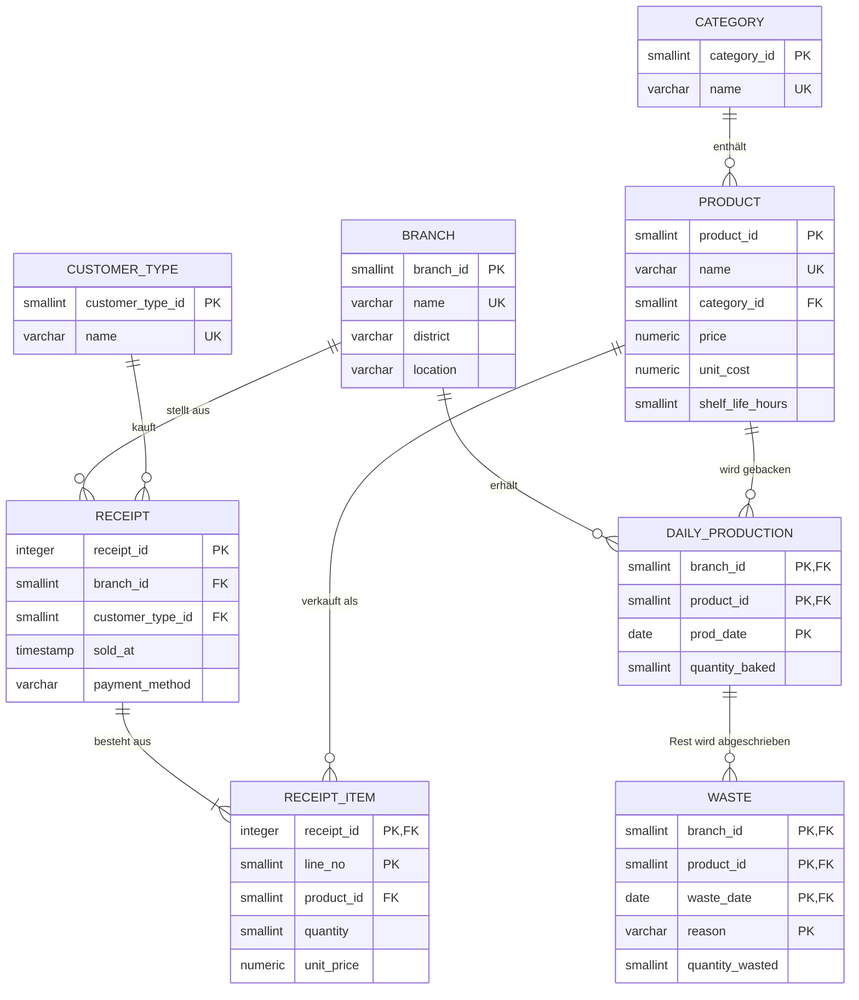

# 🥐 bakery-sales-db

**Relationale Datenbank für eine Bäckerei-Kette: Verkäufe, Produktion und Abfall analysieren, um Überproduktion zu reduzieren.**

PostgreSQL · SQL · Python · Docker

---

## Worum geht es?

Bäckereien werfen jeden Abend einen Teil ihrer Ware weg, weil sie morgens schätzen müssen, wie viel sie backen.
Backen sie zu wenig, gehen Kunden ohne Kauf. Backen sie zu viel, landet Ware im Müll.

Dieses Projekt bildet drei Filialen einer Bäckerei in Düsseldorf über ein halbes Jahr ab (Jan.–Juni 2026):
**174.000 Kassenbons, 298.000 Bonpositionen, 893.000 produzierte Teile**. Mit SQL wird untersucht,
wo Abfall entsteht, wann Kunden kommen und wie man besser planen kann.

Die Idee stammt aus meinem Nebenjob in einer Bäckerei. Die Daten sind simuliert, bilden aber Muster ab,
die man dort tatsächlich beobachtet (siehe [Datengenerierung](#datengenerierung)).

## Ergebnisse

| Erkenntnis | Wert | Abfrage |
|---|---|---|
| Anteil der Produktion, der abgeschrieben wird | **15,8 %** | C1 |
| Kosten des Abfalls (zu Herstellungskosten), 6 Monate | **58.007 €** | C2 |
| Abfallquote an Feiertagen vs. normalen Tagen | **26,2 %** vs. 15,4 % | C4 |
| Höchste Abfallquote (Produkt) | Bienenstich, 25,0 % | C1 |
| Verkaufte Brötchen pro Tag nach +10 % Preiserhöhung | −3,7 % | A4 |
| Kundenspitze Filiale Hauptbahnhof | 8–9 Uhr, ~63 Kunden/Stunde | B1 |
| Abfrage mit passendem Index | ~10–20× schneller | `explain_demo.sql` |

**Wichtigste Erkenntnis:** Die Produktion wird nach dem Durchschnitt der letzten vier gleichen Wochentage geplant.
An Feiertagen kaufen Kunden aber wie an einem Sonntag ein. Die Planung erkennt das nicht, deshalb steigt der
Abfall dort um 70 %. Eine Feiertagstabelle in der Planung würde das direkt beheben.

Außerdem: Seltene Produkte (Kuchen, Spezialbrote) haben die höchste Abfallquote **und** sind gleichzeitig am häufigsten
ausverkauft. Bei kleinen Stückzahlen schwankt die Nachfrage relativ stark, ein fester Puffer passt dann nie richtig (Abfrage C3).

## Datenmodell



Dazu zwei Nachschlagetabellen ohne Fremdschlüssel: `shift` (Schichten als Zeitfenster) und `public_holiday` (Feiertage NRW).

**Designpunkte** (ausführlich mit funktionalen Abhängigkeiten in [docs/normalisierung.md](docs/normalisierung.md)):
- Alle Relationen sind in **BCNF**.
- `receipt_item` ist eine **schwache Entität** mit zusammengesetztem Schlüssel `(receipt_id, line_no)`.
- `unit_price` speichert den Preis **zum Verkaufszeitpunkt**. Ohne ihn würden Umsätze nach der Preiserhöhung rückwirkend falsch.
- `waste` verweist über einen **zusammengesetzten Fremdschlüssel** auf `daily_production`: Abfall ohne Produktion ist unmöglich.
- `CHECK`-Constraints sichern Geschäftsregeln ab (z. B. Herstellkosten < Verkaufspreis, nur gültige Zahlarten).

## Analysen

Alle Abfragen stehen kommentiert in [`sql/analysen.sql`](sql/analysen.sql):

| | Frage | SQL-Techniken |
|---|---|---|
| A1–A4 | Umsatz je Filiale/Monat, Top-Produkte, Bonwert je Kundentyp, Effekt der Preiserhöhung | JOIN, GROUP BY, Unterabfrage, Window Function für Anteile |
| B1–B3 | Kunden pro Stunde, Umsatz je Schicht, häufig zusammen gekaufte Produkte | Views, Zeitbereichs-Join, Self-Join |
| C1–C4 | Abfallquote, Geldverlust, Ausverkauft vs. Überproduktion, Feiertage | HAVING, `FILTER`, LEFT JOIN |
| D1–D2 | Gleitender 7-Tage-Durchschnitt, Bestseller je Kategorie | `AVG() OVER (ROWS …)`, `RANK() OVER (PARTITION BY …)` |
| E1 | Produktionsempfehlung aus den letzten vier Wochen | CTE (`WITH`) |
| F1 | Plausibilitätsprüfung: produziert = verkauft + abgeschrieben | Datenqualität |

Beispiel: Abfallquote je Produkt (C1)

```sql
SELECT p.name                                                   AS produkt,
       SUM(db.quantity_baked)                                   AS produziert,
       SUM(db.quantity_wasted)                                  AS abgeschrieben,
       ROUND(100.0 * SUM(db.quantity_wasted) / SUM(db.quantity_baked), 1) AS abfallquote_prozent
FROM v_daily_balance db
JOIN product p ON p.product_id = db.product_id
GROUP BY p.name
HAVING SUM(db.quantity_baked) > 0
ORDER BY abfallquote_prozent DESC;
```

```
         produkt         | produziert | abgeschrieben | abfallquote_prozent
-------------------------+------------+---------------+---------------------
 Bienenstich (Stück)     |       4321 |          1080 |                25.0
 Streuselkuchen (Stück)  |       6339 |          1458 |                23.0
 Dinkelbrot              |       3485 |           734 |                21.1
 ...
 Körnerbrötchen          |     133044 |         20119 |                15.1
 Weizenbrötchen          |     246112 |         34788 |                14.1
```

## Performance: Indizes

PostgreSQL legt für Primärschlüssel automatisch Indizes an, für Fremdschlüssel aber nicht.
[`sql/init/03_indexes.sql`](sql/init/03_indexes.sql) ergänzt Indizes für die häufigsten Zugriffe.
[`sql/explain_demo.sql`](sql/explain_demo.sql) zeigt den Unterschied mit `EXPLAIN ANALYZE`:

| | Ausführungsplan | Laufzeit |
|---|---|---|
| ohne Index | `Parallel Seq Scan on receipt` (alle Bons lesen) | ~10–16 ms |
| mit Index auf `(branch_id, sold_at)` | `Index Only Scan` (nur passende Bons) | ~0,8 ms |

## Datengenerierung

[`generator/generate_data.py`](generator/generate_data.py) (nur Python-Standardbibliothek) simuliert den Betrieb Tag für Tag:

1. **Produktion planen** wie in einer echten Bäckerei: Durchschnitt der Nachfrage der letzten vier gleichen Wochentage plus 12 % Puffer.
2. **Kunden simulieren**, abhängig von Uhrzeit, Wochentag und Standort: Brötchen morgens, Snacks mittags, Kuchen zur Kaffeezeit.
   Das Büroviertel ist am Wochenende fast leer, der Bahnhof hat Pendlerspitzen, Firmenkunden bestellen werktags große Mengen.
3. **Ausverkauf:** Ist ein Produkt weg, geht der Verkauf verloren.
4. **Tagesabschluss:** Reste werden als Abfall gebucht.

Abfall und Ausverkäufe entstehen dadurch aus dem Ablauf selbst und sind nicht zufällig erfunden.
Die Daten sind mit festem Seed reproduzierbar.

## Starten

**Voraussetzungen:** Python 3, Docker

```bash
git clone https://github.com/Mohammadmahdi-Nemati/bakery-sales-db.git
cd bakery-sales-db
python3 generator/generate_data.py          # erzeugt die CSV-Dateien in data/
docker compose up -d                         # startet PostgreSQL und lädt alles automatisch
docker exec -i bakery-db psql -U bakery -d bakery < sql/analysen.sql   # alle Analysen ausführen
```

**Ohne Docker** (mit lokal installiertem PostgreSQL):

```bash
python3 generator/generate_data.py
createdb bakery
for f in sql/init/0*.sql; do psql -d bakery -v datadir="$PWD/data" -f "$f"; done
psql -d bakery -f sql/analysen.sql
```

## Projektstruktur

```
bakery-sales-db/
├── generator/generate_data.py   # Simulation und CSV-Export
├── sql/
│   ├── init/
│   │   ├── 01_schema.sql        # Tabellen, Schlüssel, Constraints
│   │   ├── 02_load.sql          # CSV-Import
│   │   ├── 03_indexes.sql       # Indizes
│   │   └── 04_views.sql         # Views für die Analysen
│   ├── analysen.sql             # 15 Analyse-Abfragen
│   └── explain_demo.sql         # Index-Vergleich mit EXPLAIN ANALYZE
├── docs/normalisierung.md       # FDs, BCNF, Designentscheidungen
└── docker-compose.yml
```

## Nächste Schritte

- **Version 2:** Absatzprognose mit Python (pandas, scikit-learn), die Ausverkäufe berücksichtigt.
  Der gemessene Absatz ist an ausverkauften Tagen nach oben begrenzt, die echte Nachfrage war höher.
- Feiertage und Wetter in die Produktionsplanung einbeziehen.
- Dashboard für die Filialleitung.

---

Mohammadmahdi Nemati · Informatik-Student an der Heinrich-Heine-Universität Düsseldorf
